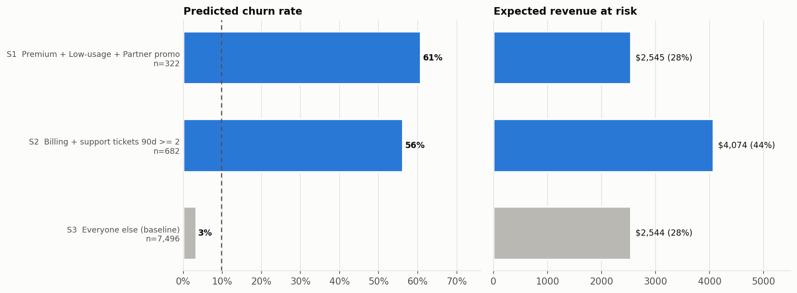

# Churn Analysis Pipeline

Give it any customer CSV with a churn column, and it explains who is leaving and why, predicts each customer's churn risk, and has Gemini write a retention plan. The results go to an interactive web dashboard.

## Web app

```bash
pip install -r requirements.txt
copy .env.example .env      # add your Gemini API key (Windows; use cp on macOS/Linux)
python app.py               # open http://127.0.0.1:5000
```

1. **Upload** a CSV and say what the business is.
2. **Check the columns.** The app shows what it detected: the churn column, the revenue column, and whether each column is categorical, numeric or excluded. Change anything that's wrong.
3. **Run.** A progress page follows each phase live, then opens the dashboard with the charts, model results, risk segments and Gemini's retention plan.

Every run is listed on the home page, so you can reopen a dashboard or change its settings and rerun.

## Command line

```
python run_pipeline.py data/sonicwave_subscribers.csv --name sonicwave --context "a music and podcast streaming service" --entity subscribers
```

| Step | Module | What it does |
|---|---|---|
| 0. Detect | `churn_pipeline/config.py` | Finds the churn column, ID, revenue column, categorical and numeric features. Drops identifiers, free text, dates, and columns fully determined by another (e.g. price set by plan). Saves an editable `runs/<name>/config.json`. |
| 1. Explore | `churn_pipeline/explore.py` | Churn rate for every attribute, ranked by how much churn it explains. **Automatic interaction search** for combinations that churn far more than their parts. |
| 2. Model | `churn_pipeline/model.py` | Compares logistic regression, logistic regression + the discovered interactions, and gradient boosting with 5-fold CV. Picks the explainable model unless boosting is clearly better. Groups customers into risk segments and writes caveats. |
| 3. Recommend | `churn_pipeline/recommend.py` | Sends the segment report and charts to Gemini, requires a fixed JSON schema back, and checks every number against the model. |
| 4. Dashboard | `churn_pipeline/dashboard.py` | Builds `runs/<name>/dashboard.html` and `docs/index.html`, which has a switcher for every dataset you've run. |
| Web app | `app.py`, `churn_pipeline/web/` | Flask app: upload, column review, live progress, dashboard. `churn_pipeline/runner.py` runs the phases for both the app and the command line. |

## How the interaction search works

Logistic regression adds feature effects together, so it can't learn "A and B together" on its own. Phase 1 does that work:

1. Every category value and numeric threshold becomes a candidate condition (`plan_type = Premium`, `tenure < 6`).
2. Every pair of conditions from different columns is scored. A pair qualifies when the rows matching both churn at least twice the overall rate *and* at least twice the rate of rows matching only one of them. That second test separates a real interaction from two independently risky attributes.
3. The strongest pairs are picked greedily, skipping near-duplicates. Each is then refined with a third condition if that isolates where the churn actually is.
4. The winners become yes/no flags for the model. Overlapping flags get correction terms, so risks that overlap don't stack.

On SonicWave this rediscovers both patterns that were originally found by hand from the charts: repeat billing complaints, and partner-promo Premium subscribers with low usage.

## Run it on your own data

```bash
pip install -r requirements.txt
copy .env.example .env        # add your Gemini API key (Windows; use cp on macOS/Linux)

python run_pipeline.py path/to/data.csv --name mydata --context "an online gym membership" --entity members
```

The first run prints what it detected and saves `runs/mydata/config.json`. If anything is wrong, edit that file and rerun with just the name:

```bash
python run_pipeline.py --name mydata
```

Useful config fields:

- `target`: the churn column. Pass `--target` on the first run if it isn't found.
- `revenue_column`: enables revenue-at-risk figures. Set it to `null` if there isn't one.
- `categorical` / `numeric`: move columns between the lists, or delete them.
- `category_order`: display order for categories, e.g. age bands.
- `business_context`, `entity`, `display_name`: wording for Gemini and the dashboard.

Other flags: `--skip-gemini`, `--dry-run` (builds the Gemini prompt without calling it), `--model`, `--redetect`.

## Example: SonicWave

8,500 subscribers of a fictional streaming service, 9.7% churn.

| Segment | Subscribers | Predicted churn | Revenue at risk / mo |
|---|---|---|---|
| S1 Premium + Low-usage + Partner promo | 322 | 61% | $2,543 |
| S2 Billing + support tickets ≥ 2 | 682 | 56% | $4,071 |
| S3 Everyone else (baseline) | 7,496 | 3% | $2,545 |

The model is logistic regression + interaction flags: ROC-AUC 0.834, the same as gradient boosting, with better-calibrated probabilities. The pipeline also flags that Premium's raw churn (13%) comes entirely from segment S1, so the Premium plan itself shouldn't be targeted.



Everything for this run is in [`runs/sonicwave/`](runs/sonicwave/): figures, `segment_risk.json`, and the Gemini plan in `recommendations.md`.

## Dashboard

Open `docs/index.html` in a browser. To host it free on GitHub Pages: in the repo, go to *Settings → Pages*, set *Source* to "Deploy from a branch", then choose `main` and `/docs`.
