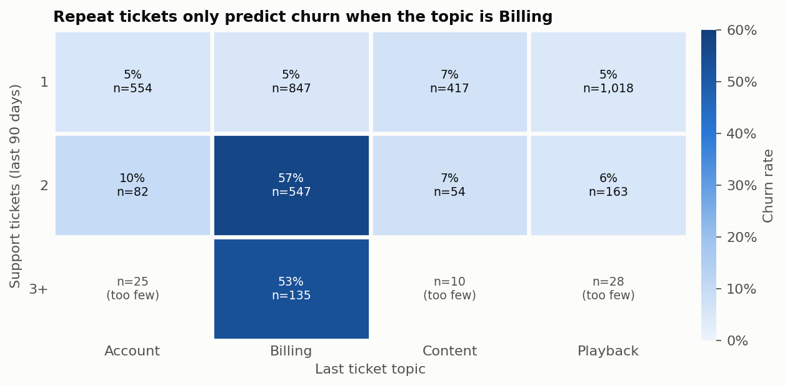
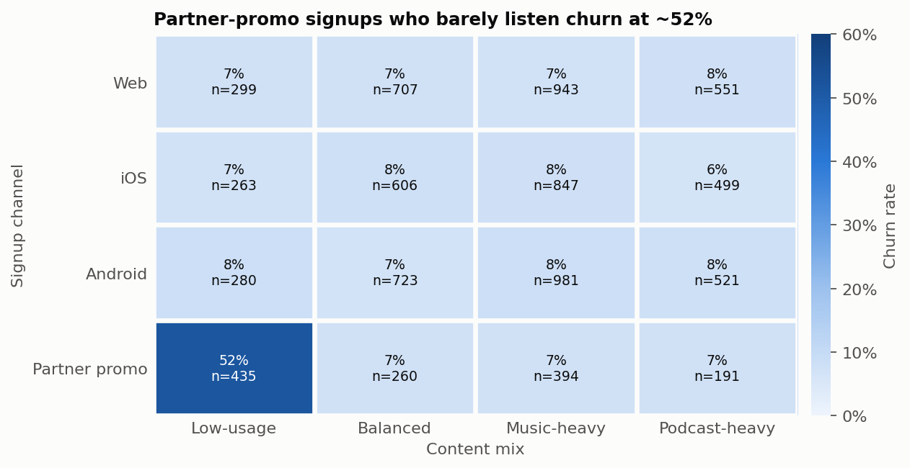
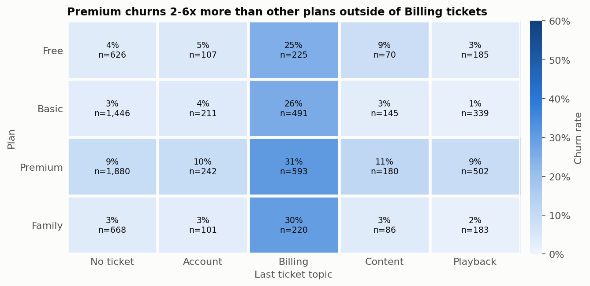
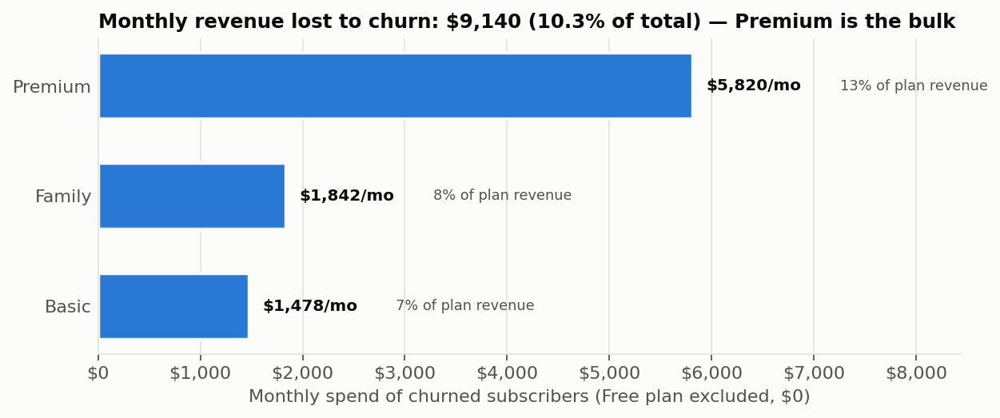
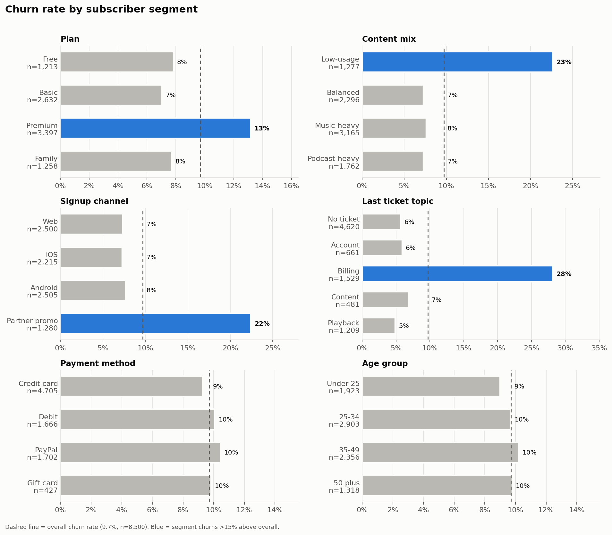
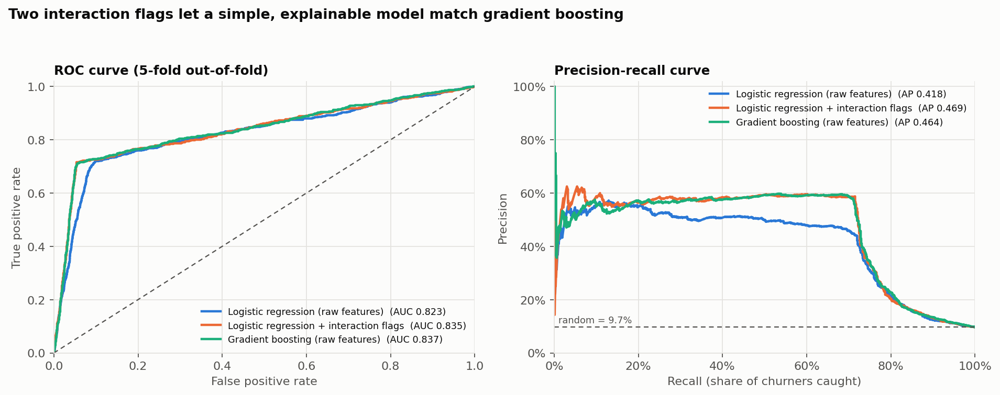
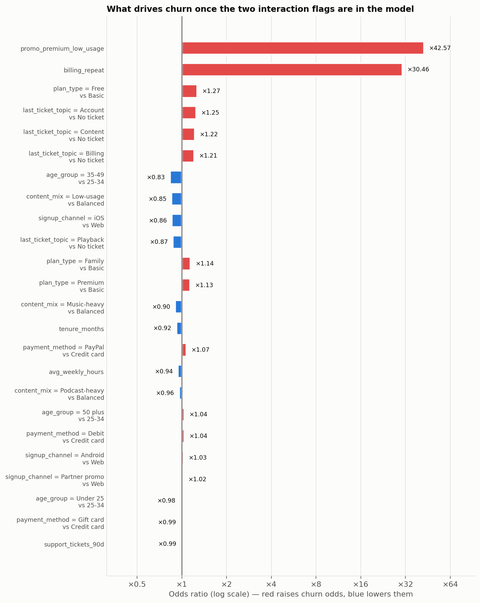
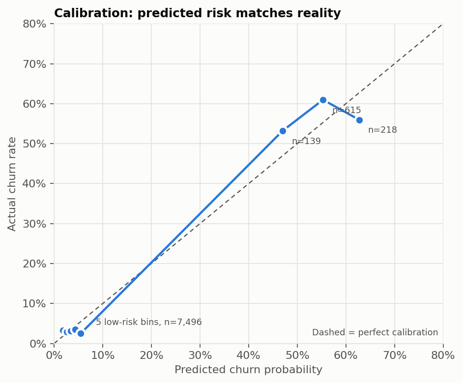
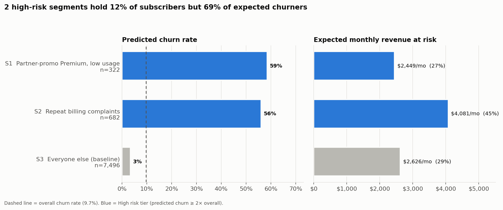

# SonicWave Churn Analysis Pipeline

An end-to-end churn analysis of 8,500 subscribers of **SonicWave**, a fictional music/podcast streaming service.

| Phase | Status | What it does |
|---|---|---|
| 1. Data visualization | ✅ Done | Find which subscriber attributes drive churn |
| 2. Churn model | ✅ Done | Custom probability model predicting each subscriber's churn risk |
| 3. Recommendations | Planned | Gemini/Gemma API turns model predictions into business recommendations |

## Dataset

`data/sonicwave_subscribers.csv` has 8,500 rows, 12 columns and no missing values. The overall churn rate is **9.7%**.

| Column | Description |
|---|---|
| `subscriber_id` | Unique ID |
| `age_group` | Under 25 / 25-34 / 35-49 / 50 plus |
| `plan_type` | Free / Basic ($7.99) / Premium ($12.99) / Family ($18.99) |
| `tenure_months` | Months subscribed (1–60) |
| `monthly_spend` | Monthly price paid |
| `avg_weekly_hours` | Average weekly listening hours |
| `content_mix` | Balanced / Music-heavy / Podcast-heavy / Low-usage |
| `payment_method` | Credit card / Debit / PayPal / Gift card |
| `support_tickets_90d` | Support tickets in the last 90 days |
| `last_ticket_topic` | Account / Billing / Content / Playback / No ticket |
| `signup_channel` | Web / iOS / Android / Partner promo |
| `churned` | 1 = churned, 0 = retained (target) |

## Phase 1 — Key findings

**1. Repeat billing tickets are the strongest churn signal.** Subscribers with 2+ tickets whose last ticket was about billing churn at 53–57%. Repeat tickets on any other topic stay at 0–10%.



**2. Partner-promo signups who never start listening churn at 52%.** Partner promo with any other content mix churns at ~7%, the same as every other channel.



**3. Premium churns at 13% vs 7–8% for other plans** and accounts for most of the ~$9.1k in monthly revenue lost to churn. *(Phase 2 shows this is almost entirely the partner-promo effect — see below.)*




**4. Tenure, listening hours, age and payment method barely move churn.** Oddly, actual weekly hours show no pattern while the `Low-usage` content-mix label churns at 23%, so the two columns measure different things.



All charts: [`figures/`](figures/). Heatmap cells with fewer than 30 subscribers are marked "too few" instead of showing a rate.

## Phase 2 — Churn model and risk segments

`train_churn_model.py` compares three models with 5-fold stratified cross-validation:

| Model | ROC-AUC | PR-AUC | Brier |
|---|---|---|---|
| Logistic regression (raw features) | 0.823 | 0.418 | 0.0685 |
| **Logistic regression + interaction flags** (chosen) | **0.835** | **0.469** | **0.0566** |
| Gradient boosting (raw features) | 0.837 | 0.464 | 0.0586 |

Phase 1 showed churn concentrates where two conditions meet, which a linear model can't learn on its own. Two engineered flags (`features.py`) fix that:

- `billing_repeat`: 2+ support tickets in 90 days and the last one was about Billing
- `promo_premium_low_usage`: signed up via Partner promo, on Premium, Low-usage content mix

With them, plain logistic regression matches gradient boosting while staying fully explainable through odds ratios. The top 10% of subscribers by predicted risk churn at ~60% (6.2× lift) and contain ~62% of all churners.





### Risk segments

A shallow surrogate decision tree fitted to the out-of-fold churn probabilities splits the base into segments you can act on:

| Segment | Subscribers | Predicted churn | Revenue at risk / mo |
|---|---|---|---|
| S1 Partner-promo Premium, low usage | 322 | 59% | $2,449 |
| S2 Repeat billing complaints | 682 | 56% | $4,081 |
| S3 Everyone else (baseline) | 7,496 | 3% | $2,626 |



**Correction to Phase 1:** the partner-promo low-usage effect is *only* Premium. Non-Premium partner-promo low-usage subscribers churn at 2–4%. Outside segment S1, Premium churns like every other plan, so Premium's higher raw churn rate comes from who is on it rather than the plan itself.

The full segment report for Phase 3 is [`outputs/segment_risk.json`](outputs/segment_risk.json). It has each segment's rule, size, predicted vs actual churn, revenue at risk, distinguishing traits, the model's churn drivers, and caveats. It contains no subscriber IDs.

## Run it

```bash
pip install -r requirements.txt
python visualize_churn.py    # Phase 1: figures 01-07
python train_churn_model.py  # Phase 2: model, outputs/segment_risk.json, figures 08-11
```
